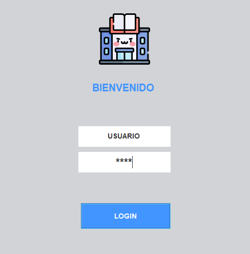
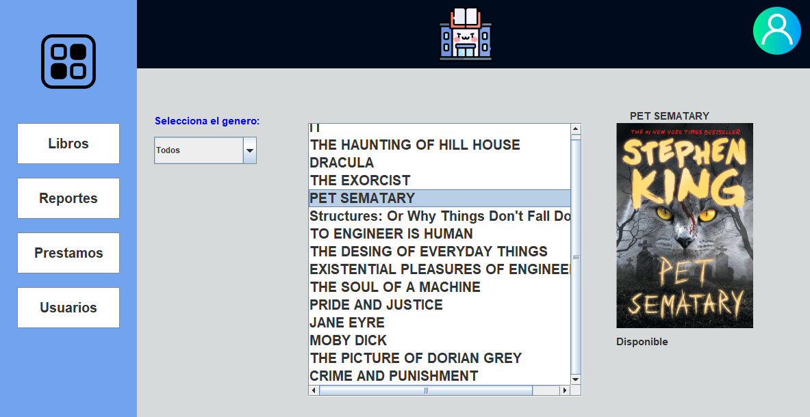

# Biblioteca 📚

 # Descripción

Este proyecto es una aplicación de biblioteca de escritorio desarrollada en Java, diseñada para gestionar el inventario de libros, préstamos y devoluciones, con funcionalidades avanzadas de gestión de usuarios basada en roles.
|  |  |
|---------------------------------------------------|---------------------------------------------------|
| *Login*                    | *Interfaz*                          |

